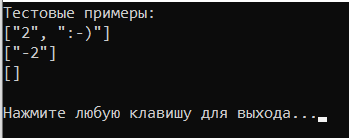
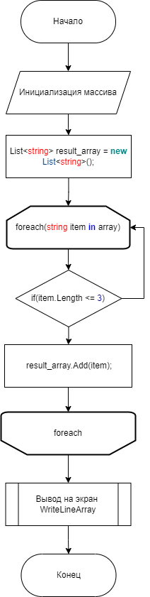

# Файл LessThreeLetters.cs #

Создано две функции:

1. LessThreeLetters - функция получения массива строк с элментами строк, длина которых меньше или равна 3 символам.
2. WriteLineArray - функция вывода массива строк на экран.

Проведены тестовые испытания на примере из задания.
## Полученные результаты: ##

## Диаграмма: ##

URL: https://github.com/maygeekbrains/test_prg